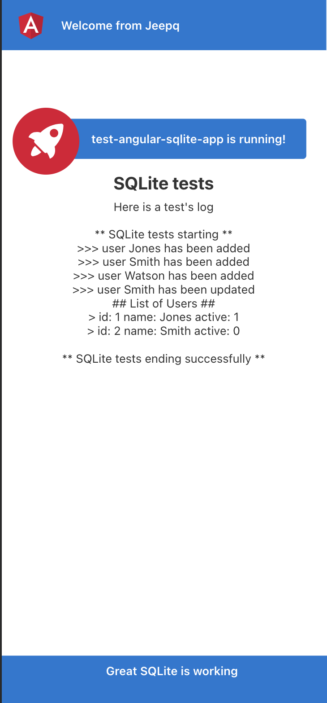

#  test-angular-sqlite-app

This is an example of a pure angular application using @capacitor-community/sqlite.

Request: Add examples for angular and sqlite without Ionic. #499

## Installation

```bash
git clone https://github.com/jepiqueau/test-angular-sqlite-app.git
cd test-angular-sqlite-app
npm install
```

## Run on Web

```bash
npm start
```

### Results




## Run on Native

 - Open the capacitor.config.ts file and add

```ts
  plugins: {
    CapacitorSQLite: {
      iosDatabaseLocation: 'Library/CapacitorDatabase',
      iosIsEncryption: false,
      iosKeychainPrefix: 'angular-sqlite-app-starter',
      iosBiometric: {
        biometricAuth: false,
        biometricTitle : "Biometric login for capacitor sqlite"
      },
      androidIsEncryption: false,
      androidBiometric: {
        biometricAuth : false,
        biometricTitle : "Biometric login for capacitor sqlite",
        biometricSubTitle : "Log in using your biometric"
      }
    }
  }
```

 - Install rimraf

```bash
npm install -D rimraf
```

 - Modify the script in the package.json file 

```json
"scripts": {
  ...
  "remove:sql:wasm": "rimraf src/assets/sql-wasm.wasm",
  "angular:ios": "npm run remove:sql:wasm && ionic capacitor build ios",
  "angular:android": "npm run remove:sql:wasm && ionic capacitor build android",
  ...
}
```

```bash
npm run build
npx cap add ios
npx cap add android
npm run angular:ios
npm run angular:android
```

